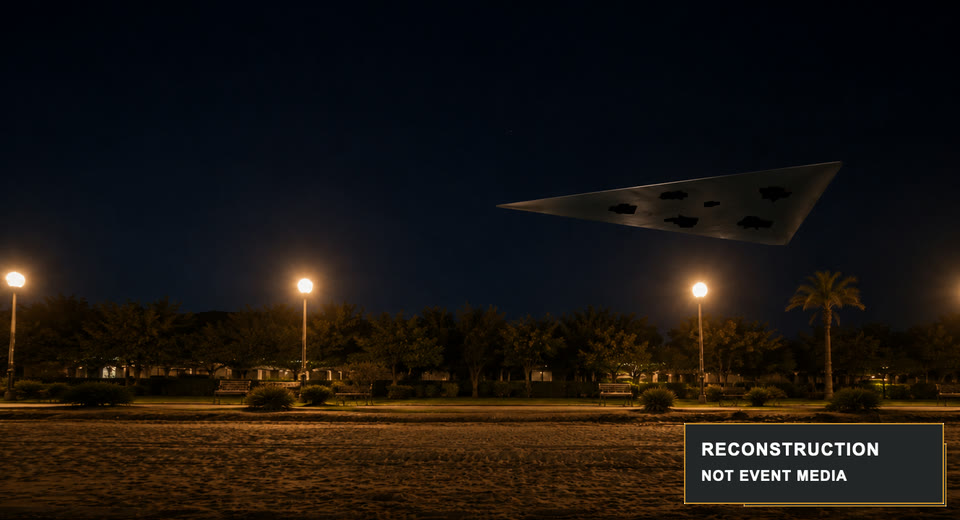

# AMT-01: What did I see?

In summer 2004, near the Antalya coast, I saw a dark triangular object move past at close range. I still do not know what it was. This open project shares my account, reconstructions from memory, and work to check possible explanations.

[](https://amt01.vercel.app/#reconstructions)

**Reconstruction from memory — not event media.** Shape, scale, lighting, and setting are approximate.

**[Explore the reconstructions](https://amt01.vercel.app/#reconstructions)** · [Read the short account](docs/01-case-amt01/00-case-summary.md) · [Help with one small task](docs/06-research-program/03-first-contributions.md)

## Help with one question

You do not need a complete explanation to help. Pick one:

| Task | A useful contribution |
|---|---|
| [Check the speed estimate](docs/06-research-program/03-first-contributions.md#check-the-speed-estimate) | Reproduce the arithmetic and show how changing an estimate affects the result. |
| [Compare one known object](docs/06-research-program/03-first-contributions.md#compare-one-known-object) | Link a dated source for a candidate, explain one fit and one mismatch. |
| [Make one detail clearer](docs/06-research-program/03-first-contributions.md#make-one-detail-clearer) | Point to an unclear sentence or broken link and propose a specific correction. |

[Discuss an idea on Discord](https://discord.gg/JVvHf5cXhs). For a research or code submission, follow the [contribution guide](CONTRIBUTING.md).

## What we have — and what we do not

The project begins with one retrospective witness record, a later sketch, corrections, and visual reconstructions. No known event photograph or video, independent witness record, or sensor measurement is available. The exact date, site, distance, dimensions, and speed were not established by instruments.

The object remains unidentified. “UFO” here does not claim an extraterrestrial origin. Calculations are conditional on later estimates, and [ordinary and perceptual explanations remain open](docs/03-hypotheses/01-evaluated-alternatives.md).

**Have an observation of your own?** Use the [private witness form](https://tally.so/r/5BgZMb), not a public issue or Discord post. New reports may omit a name and contact details, and are never published automatically. The form also handles privacy requests. See [privacy](PRIVACY.md) and [consent and takedown](CONSENT_AND_TAKEDOWN.md) before submitting.

## Explore the research

- **The account:** [full witness record](docs/01-case-amt01/01-full-observation-record.md), [uncertainties](docs/01-case-amt01/03-uncertainty-register.md), and [memory and correction timeline](docs/01-case-amt01/04-memory-and-correction-timeline.md).
- **The analysis:** [geometry and speed](docs/02-derived-analysis/00-geometric-and-kinematic-analysis.md), [hypothesis registry](docs/03-hypotheses/00-hypothesis-registry.md), and [comparison notes](docs/03-hypotheses/01-evaluated-alternatives.md).
- **The record:** [claim ledger](docs/00-foundation/02-claim-ledger.md), [decision history](docs/07-reference/02-decision-log.md), and [legacy decision-ID map](docs/07-reference/05-legacy-decision-id-map.md).

<details>
<summary>Repository structure and research labels</summary>

```text
docs/00-foundation/          Method and claim ledger
docs/01-case-amt01/          Witness record, uncertainty, corrections
docs/02-derived-analysis/    Conditional calculations
docs/03-hypotheses/          Explanations and comparison notes
docs/04-speculative-models/  Separate speculative thought models
docs/05-external-evidence/   Comparison sources and source protocol
docs/06-research-program/    Questions, starter tasks, work packages
docs/07-reference/          Decisions, references, glossary, history
data/                        Machine-readable migration prototype
schemas/                     Versioned schema prototype
site/                        Static public website
templates/                   Record templates
tools/                       Validation tools
```

The record distinguishes `OBS` (recollection), `EST` (later estimate), `DER` (calculation), `INF` (interpretation), `HYP` (explanation to test), `EXT` (external claim), `DEC` (decision), and `UNK` (unknown). These labels describe a statement's source and role, not its proof strength.

Force Skin, MEVE, Q-MEVE, transmedium, and warp-related documents remain separate [speculative models](docs/04-speculative-models/README.md), not established explanations.

</details>

## Project status and review

The initial public release is `v0.1.0`. The dataset is a migration prototype, not a complete multi-case corpus. Some comparison sources, calculations, and original media-production details still need independent review. Public reconstruction assets have release hashes, lineage, rights information, and embedded disclosures.

AI assistance is disclosed under the [AI-use policy](AI_USE_POLICY.md). AI output is not a witness, original source, or independent verifier. Accepting a contribution records its sources and review status; it does not authenticate the event or endorse an explanation.

Project responsibilities are in [governance](GOVERNANCE.md). See the [code of conduct](CODE_OF_CONDUCT.md), [support routes](SUPPORT.md), and [rights and attribution](RIGHTS_AND_ATTRIBUTION.md) when relevant to your contribution.

## Run the website locally

The website is plain HTML, CSS, and JavaScript. No dependency installation or build step is needed.

```bash
python3 -m http.server 4173 --directory site
```

Open [localhost:4173](http://localhost:4173). The public site is [amt01.vercel.app](https://amt01.vercel.app/); Vercel deploys `site/` from `main`. See [website setup](site/README.md) for deployment settings.

<details>
<summary>Repository validation commands</summary>

Run the current machine-readable fixture check from the repository root:

```bash
node tools/validate_bundle.mjs
```

The complete dependency-free validation set is:

```bash
node tools/validate_bundle.mjs
node tools/audit_decision_log.mjs docs/07-reference/02-decision-log.md docs/00-foundation/02-claim-ledger.md
node tools/validate_media_provenance.mjs
node tools/check_local_links.mjs
node --check site/script.js
node --check site/site-config.js
```

</details>

## Licensing

This is a mixed-license open project:

- software and schemas are licensed under Apache-2.0;
- project documentation, structured public data, the witness record, and rights-controlled reconstruction media are licensed under CC BY 4.0;
- the code of conduct is an adaptation of Contributor Covenant 3.0 under CC BY-SA 4.0;
- attribution must credit **AMT-01 Project contributors** and link back to the [canonical repository](https://github.com/verbitski/amt-01-ufo-investigation);
- third-party works and internal material are excluded.

See [LICENSE.md](LICENSE.md) and [RIGHTS_AND_ATTRIBUTION.md](RIGHTS_AND_ATTRIBUTION.md) for the exact path and asset scope.
