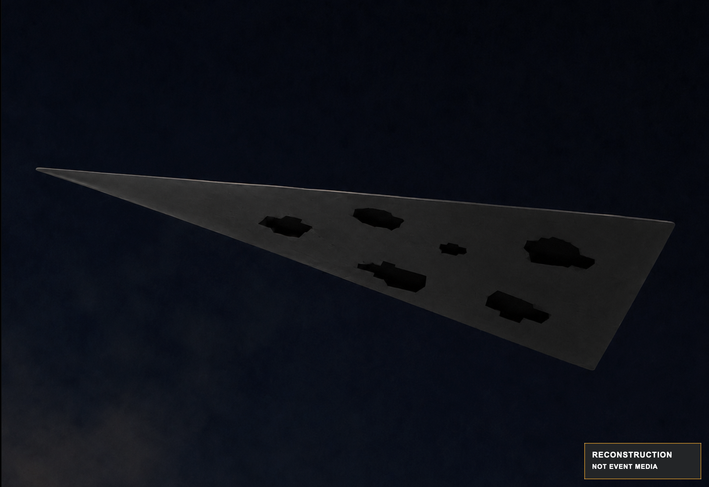

# AMT-01 Sketch and Surface Record

## Later reconstruction sketch

This image was created after the event. It is a reconstruction, not a contemporaneous drawing, photograph, measurement, or independent source. The disclosure is baked into the public file so it remains visible when the image is downloaded or reposted. Its public hash and source lineage are recorded in the [media provenance manifest](../../site/assets/provenance.json).

## Accuracy statement

The sketch is reliable only for broad topology:

- elongated triangular planform;
- pointed nose;
- straight rear edge;
- roughly 5–7 irregular black regions as a later count estimate;
- black regions concentrated primarily in the middle/rear portions.

The witness does **not** guarantee the exact position, size, shape, count, or orientation of individual black regions.

## Surface observations

### Main underside

- flat;
- visually continuous;
- no seams;
- no obvious mechanical segmentation;
- dark matte finish;
- low return of visible light;
- distinguishable from the black regions under lamp illumination.

### Black regions

The black regions looked different from the main surface. The main surface was dark but visible; the regions appeared completely black to the witness, with no internal reflection visible. The observation does not establish their material, depth, reflectance, or function.

## Current terminology

Use:

- **black regions** when referring to the observation;
- **region-like zones** when discussing approximate geometry;
- **window or aperture hypothesis** only when explicitly discussing a hypothesis.

Avoid calling them “holes” unless future evidence demonstrates physical openings.

## Questions raised for analysis

1. Could ordinary shadow, viewing angle, image memory, or a low-reflectance surface produce the remembered appearance?
2. Would any proposed opening, rotor, duct, nozzle, sensor, or optical treatment predict the remembered irregular layout?
3. What observations would distinguish a physical opening from a flat dark surface?
4. Which claims depend only on the regions' existence, rather than their uncertain count or topology?
5. Can a proposed explanation make a numerical prediction that could be tested without treating the sketch as exact geometry?
